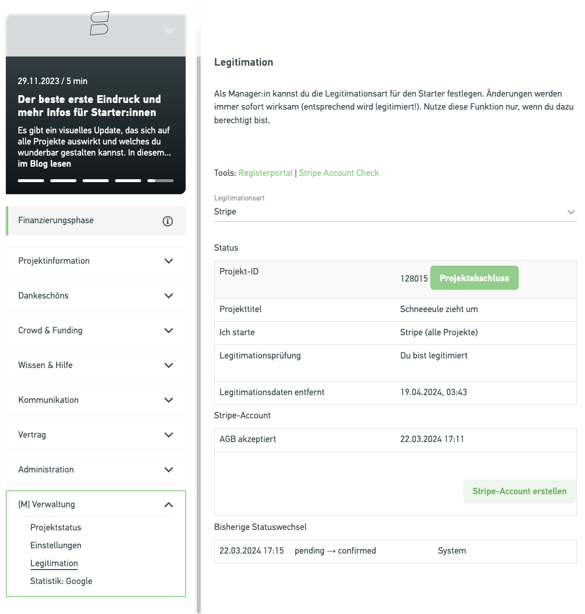
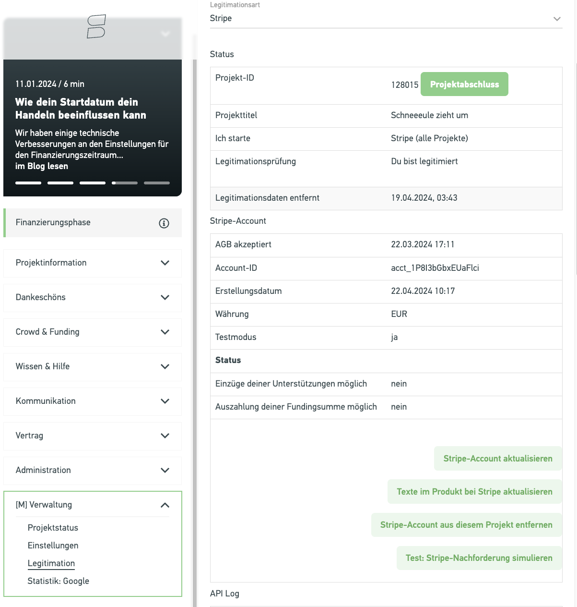
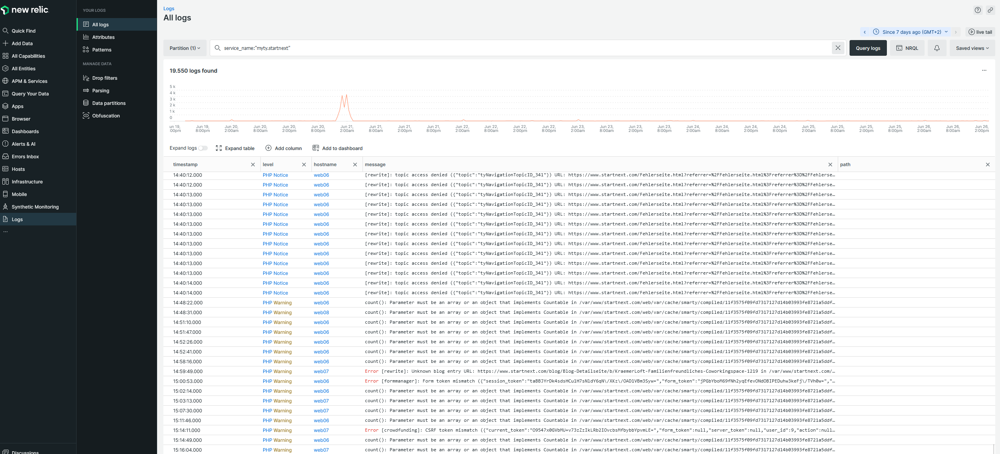
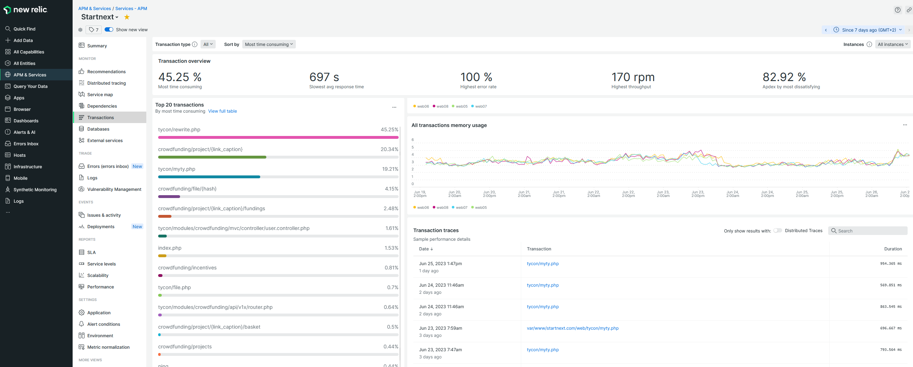
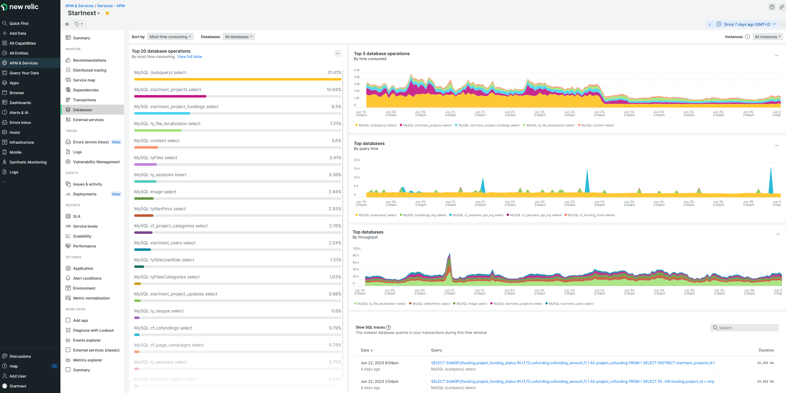
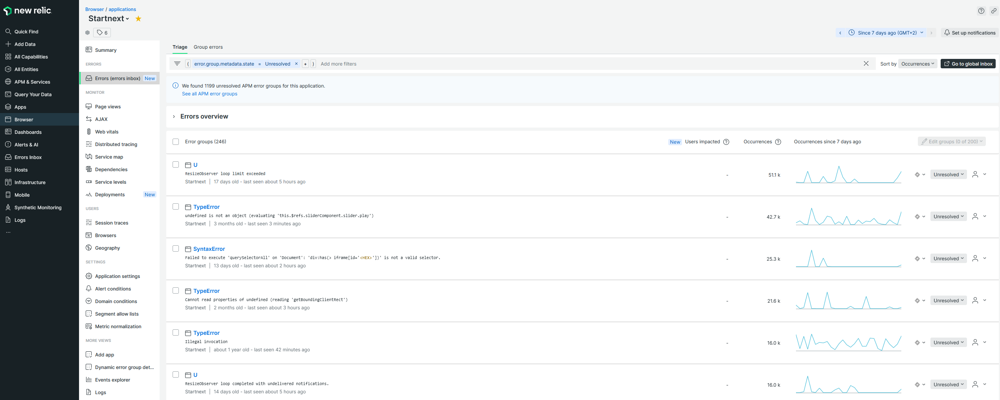
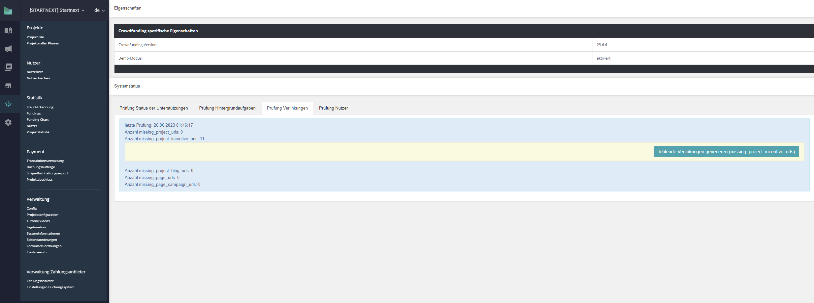

# Auswertungen

## 2023

### Milestones

- 02 Stripe: Zahlungsdaten als angemeldeter Nutzer speichern
- 02 Rückbau Projectteam (Reduzierung auf Projektteam)
- 02 Rückbau Secupay
- 02 Rückbau Investment
- 02 Umbau der letzten alten mehrsprachigen Models
- 03 Checkout: Speicherung Land auf ISO Code umgestellt (Abwärtskompatibel zu alten Unterstützungen, wo Landname
  gspeichert)
- 03-05 Facelift Projektinterface (inkl. in Teilen auch bei Pageinterface und Managerinterface)
    - Formulare einspaltig
    - keine Anzeige der Nummern für Phasen
    - alle Tabs werden angezeigt, ggf als deaktiviert, wenn in aktueller Phase nicht bearbeitbar oder wenn keine
      Berechtigung
    - Projektinterface mobil verfügbar
- 04 Umstellung Legitimation Stripe
    - Einführung Selfiecheck
    - keine Übergabe von Organisation- bzw. Personendaten an Stripe bei Account-Erstellung
    - keine Abfrage mehr der Rechtsform bei Projekten
- 05 Serverseitige Speicherung Warenkorb (shop_basket, cf_basket für Projektbezug)
- 05 Bestellung verschiedener Varianten eines Dankeschöns

## 2022

### Milestones

Die Zahl am Zeilenanfang gibt den Monat an.

* 01 Relaunch Projektliste mit Elastic Search
* 01 Buchungscron auf Hintergrundaufgabe umgestellt
* 01 Page: Contest und Boost sind als Kampagne nicht mehr möglich
* 01 Projekt: separater Spendenexport bei gemeinnützigen Projekten wurde in normalen Fundingliste integriert
* 02 Projekt: Umstellung Versand der Blogeinträge komplett auf Fans
* 02 Projekt: Aktivierung Löschung Rechnungsdaten nicht erfolgreicher Projekte
* 03 Zugriff auf Listen des Managerinterface in Nutzersidebar ausgelagert
* 03 Nutzer: Angabe soziale Netzwerke erweitert
* 03 Projekt: Feier-Email bei erreichter Punktezahl für Vielfaltoskop
* 03 Umstellung Controller-Logik Pages, bei Umbenennung fungiert der alte Link nun als Weiterleitung zum neuen Link
* 03 Projekt: Projektverlängerung durch Starter:innen
* 03 Legitimation: Änderung des Business Types per API Call
* 03 Projekt: Aufnahme Starter-PWYW in Application Fee, kein separater Buchungsauftrag für Starter-PWYW bei Auszahlung
  mehr
* 04 Übersicht der freigeschalteten Projekten als Mail ins Equify
* 04 bei Auszahlung werden die Fundinglisten nun zu S3 exportiert und Starter/Manager greifen auf diese Version zu
* 04 Projekt: Angabe soziale Netzwerke erweitert
* 04 Managerinterface: Fraudliste integriert
* 05 Legitimation: Land und IBAN müssen übereinstimmen
* 05 Abschluss-Workflow für aktive manager-only Projekte integriert und nachträgliches Ablehenn von abgeschlossenen
  manager-only Projekten ermöglicht
* 05 Projekt: Startleveländerungen durch Starter:innen
* 05 Reduzierung Komplexität Rechteprüfung CFM
* 06 Page: Blog entfernt
* 06 Mails auf Smarty umgestellt
* 06 Projekt: Einführung SDG
* 06 Einführung Fraud-Prüfung per RISK IDENT
* 07 Automatisierte Gutschrift-Rechnungen für zurückgezahlte Unterstützungen
* 07 Ermöglichung SDG Newsletter
* 07 Projekt/Legitimation: Umsatzsteuerpflicht für Marktplätze
* 07 interne API-Dokumenation auf Open API 3.0 angehoben
* 07 Kennzeichnung von potenziellen Fraud Unterstützungen in TA-Verwaltung
* 08 Rückbau alter Zahlungsarten (MPay, Girosolutions, Saferpay, Cardprocess)
* 08 Rückbau alte Legitimation/Verifizierung: postident, bankident, upload, fidor wird entfernt, Nutzerverfizierung via
  Peax
* 08 Projekt: PWYW Starter:innen V3
* 08 Einführung Postfunding-Projekte
* 08 Übersicht Warenkörbe
* 09 Projekt: Schlagworte reaktiviert und vorbereitet für Vertaggung durch Manager
* 10 Checkout: Unterstützer werden automatisch Fan (folgen dem Projekt)
* 10 Pinnwand-Box auf Checkout-Erfolgsseite
* 10 Projekt: Erweiterung Bilder für Dankeschöns (es können nun bis zu 5 Bilder angegeben werden)
* 11 neuer Checkout
* 11 PayPal für Postfunding-Projekte
* 12 PayPal für pxp
* 12 Teaserschnipsel mit vielen Einstellungsmöglichkeiten

### Kennzahlen

* 2022 komplett mit einer myty-Version gearbeitet (v5.25.x)
* Backend - CFM 22.1 (01/2021) - CFM 22.17.3 (01/2022)
    * 49 Versionen, 17 Hauptversionen
    * ~ 2.043 Commits
        * ``git rev-list v22.1.0..staging-v22.17.3 --count``
    * ~ 345 Merge Request
* 1.184 files changed, 76.297 insertions(+), 63.311 deletions(-)
    * ``git diff --shortstat v22.1.0 staging-v22.17.3``
* Frontend: 2022-01-05 bis release-2023-01-04-eq1379669
    * 60 Releases
    * ~ 18.093 Commits
        * ``git rev-list 2022-01-05 release-2023-01-04-eq1379669 --count``
    * 3.190 files changed, 138.839 insertions(+), 198.524 deletions(-)
        * ``git diff -l 4000 --shortstat 2022-01-05 release-2023-01-04-eq1379669``

Auswertung mittels Auswertung Code mittels https://github.com/sebastianbergmann/phploc

CFM 22.1.0 -> CFM 22.17.3

* Directories 226 -> 210
* Files 1.418 -> 1.379
* Size
    * Lines of Code (LOC)                     244.207 -> 235.933
    * Comment Lines of Code (CLOC)            44.283 (18.13%) -> 44.474 (18.85%)
    * Non-Comment Lines of Code (NCLOC)       199.924 (81.87%) -> 191.459 (81.15%)
    * Logical Lines of Code (LLOC)            61.184 (25.05%) -> 57.739 (24.47%)
    * Classes 43.742 (71.49%) -> 43.458 (75.27%)
    * Functions 5.792 (9.47%) -> 4.459 (7.72%)
    * Not in classes or functions 11.650 (19.04%) -> 9.822 (17.01%)
* Dependencies
    * Global Accesses 2494 -> 1869
    * Global Constants 60 (2.41%) -> 42 (2.25%)
    * Global Variables 1.203 (48.24%) -> 694 (37.13%)
    * Super-Global Variables 1.231 (49.36%) -> 1.133 (60.62%)
    * Attribute Accesses 10.950 -> 9.481
    * Method Calls 48.125 -> 47.012
* Structure
    * Namespaces 102 -> 100
    * Interfaces 8 -> 7
    * Traits 49 -> 65
    * Classes 917 -> 933
    * Methods 7.603 -> 7.516
    * Constants 1.685 -> 1.442

## 2021

> [Übersichtsbeitrag](https://equify.de/Portal/m/1219269/eq/Rekapitulation-2021---Plattformentwicklung)

### Milestones

* 01/2021: Trennung CFM zwischen Startnext und Tyclipso
* 02/2021: Entfernung Mandantenkonfigurator
* 02/2021: MIB - Projekte mit und ohne Fundingziel
* 02/2021: Funding Level
* 03/2021: Sessionumstellung
* 03/2021: Integration PHPStan in GitLab Pipeline
* 03/2021: Rückbau Abofunding / Lending
* 03/2021: Dankeschöns & Checkout um Angabe von Varianten erweitert, neue Links für Dankeschöns
* 06/2021: Vielfaltoskop
* 06/2021: Überarbeitung/Erweiterung Sitemaps für Projekte
* 07/2021: Launch Snuugl
* 07/2021: Design System
* 07/2021: automatische Freigabe von Projekten für Finanzierung
* 07/2021: Start Löschung der ersten inaktiven Projekte
* 08/2021: Umstellung Abschlusscron auf Hintergrundaufgabe
* 09/2021: Vielfaltoskop für Starter im Projektinterface aktiviert
* 09/2021: Header Vereinheitlichungen
* 09/2021: Clean Content Vereinheitlichungen (still in process)
* 09/2021: Statusanpassung für Projekte
    * Starter können nicht erfolgreiche Projekte "löschen"
    * Starter können selbständig aus der Startphase in den Entwurf zurück wechseln
* 09/2021: Hintergrundaufgaben überarbeitet
    * Abschaffung der separaten Abarbeitung im CFM und Konsolidierung der Abarbeitung im myty
* 10/2021: Umstellung Nutzerprofile
    * bis auf Starter-Profile (inkl. Projektteam) sind keine weiteren Profile mehr einsehbar
* 10/2021: Projektdetail mit großer Galerie/ Video
* 11/2021: Unterstützung Gemeinnützigkeit bei Stripe
* 11/2021: Rückbau Subplattform
* 11/2021: Vielfaltoskop Slider
* 11/2021: Aktivierung Elasticsearch für Snuugl
* 12/2021: neue Header-Optionen
* 12/2021: Übermittlung Adresse an Stripe für Zahlungen
* 12/2021: Überarbeitung Equify-Integration - Übernahme Abstraktion von tyclipso und Optimierung bei Broadcast und
  Sichtbarkeit von Flaschenhälsen
    * Finalisierung Januar 2022
    * Abschaffung alten Buchungscron und Umstellung auf myty Hintergrundaufgabe
    * neue Projektliste
    * neue Dankeschönwidgets im Projekt

### Kennzahlen

* Backend - CFM 3.24 (01/2021) - CFM 21.21.1 (12/2021)
    * 52 Versionen, 22 Hauptversionen
    * ~ 3.610 Commits    (2020: ~ 2.300 Commits)
    * ~ 390 Merge Request    (2020: ~ 410 Merge Requests)
* Zeilen hinzu:  293’661; entfernt: 273’472
* Frontend: 2021-01-06 bis 2021-12-15
    * 64 Releases
    * ~ 2.679 Commits
    * Zeilen hinzu: 665’445; entfernt: 514’065
* CFM 3.24 (01/2021) (Solar Lint)
    * 834 Bugs
    * 3 Vulnerabilitäten
    * 3,4% doppelter Code
    * 8.998 Code Smells
    * 273.228 Zeilen Code
    * 879 Klassen
    * 9,5% Inline-Kommentare
    * 3,2% Testabdeckung
* CFM 21.21.1 (12/2021)
    * 370 Bugs
    * 0 Vulnerabilitäten
    * 3,6% doppelter Code
    * 5.520 Code Smells
    * 247.946 Zeilen Code
    * 157k PHP
    * 62k YAML
    * 13k JavaScript
    * 12k CSS
    * 4,3k XML
    * 909 Klassen
    * 10,1% Inline-Kommentare
    * 6,8% Testabdeckung

## 2020

> [Übersichtsbeitrag](https://equify.de/Portal/m/1044248/eq/Team-Backend---Rekapitulation-2020-aktueller-Stand-Planung-2021)

* Umstellung auf Multiserver
* 03/2020 - Optimierung Ermittlung verkaufte Dankeschöns (Performanceproblem von Olympia)
* 05/2020 - Umstellung auf Deployment via GitLab Pipeline
* 06/2020 - Rechnungsexport zu S3 Storage
* 07/2020 - Aktivierung neue Controllerlogik für Projekte (statt nginx wird über myty geroutet)
* 10/2020 - Umstellung auf PHP 7.4
* Aktivierung/Umstellung auf Zahlungsanbieter Stripe
* Aktivierung/Umstellung auf Legitimierung via Stripe
* Erweiterung Projekt- und Fundinglog, um Aktionen transparenter nachvollziehen zu können
* Entfernung veralteter Implementationen
    * Aktivitätenstream
    * Fidor
    * Secupay v2
    * PayPal Adaptive
    * 1-Cent-Verifizierung Auszahlungskonto
    * Projektumfrage
    * Unterstützung mehrere myty Mandaten
* Umzug der Dokumentation ins Repository
* 01/2021 - Finalisierung GitLab Pipeline, so dass keine generierten Ressourcen mehr im Repository sich befindet

### Kennzahlen

* CFM 3.11 (01/2020) - CFM 3.24 (01/2021)
* ~ 410 Merge Request
* ~ 2.300 Commits (with 37.735 additions and 96.802 deletions)
* Sonar - 2020 wurden die hinterlegten Regeln für Bugs und Vunerablilities im Sonar überarbeitet, daher ist kein
  direkter Vergleich zwischen den Werten von 01/2020 und 02/2021 möglich
* CFM 3.11 (01/2020)
    * 42 Bugs
    * 55 Vunerablilities
    * 5% doppelter Code
    * \> 15.000 Code Smells
    * 147.402 Zeilen Code
    * 857 Klassen
    * 15,3% Inline-Kommentare
    * 2,4% Testabdeckung (Unittests)
* CFM 3.24 (01/2021)
    * 834 Bugs
    * 3 Vunerablilities
    * 3,4% doppelter Code
    * 8.998 Code Smells
    * 273.228 Zeilen Code
    * 879 Klassen
    * 9,5% Inline-Kommentare
    * 3,2% Testabdeckung

## 2019

> [Übersichtsbeitrag](https://equify.de/Portal/m/854169/eq/Team-Backend---Rekapitulation-2019-aktueller-Stand-Planung-2020)

### Milestones

* Upgrade cfm auf Nutzung myty > 5.6
* Pagesumbau (Kampagnen)
* Umbau Exporte auf Excel und Hintergrundaufgaben
* Einführung Stripe
* Einführung Statusüberprüfungen / Monitoring für Projekte, Pages und NUtzer
* Entfernung der alten Logik hinsichtlich Gastunterstützer
* Folgende Bestandteile wurden entfernt:
    * Contesttypen: Abstimmung (Typ: vote), Anzahl Fans (Typ: fan), virtuelles Budget (Typ: vote_budget), Anzahl Fans (
      live) (Typ: fan_count)
    * erste Version des Messagingsystems
    * Pagemodule: Subdomain, Whitelabel, Voucher
    * Buyout
    * erste Version eines Abomoduls
    * API Endpunkte für Rückgabe von Unterstützungen eines Nutzers und eines Projektes entfernt

# Wissen zu Review-Apps

## Projekte zum Unterstützen freischalten

Durch die Anonymisierung der Datenbank sind in Review-Apps (gilt auch für das Test-Web & Dev-Webs) nur unsere
Testprojekte unterstützbar. Folgende Fehlermeldung ist im Checkout sichtbar:


Um jegliches Projekt unterstützbar zu machen, muss im jeweiligen Projekt im Projektinterface unter Verwaltung ->
Legitimation der Button `Stripe-Account erstellen` gedrückt werden.



Nach einer kurzen Wartezeit wurde ein Test-Stripe-Account für das Projekt angelegt und es ist wieder unterstützbar.
Im Projektinterface ist dann folgendes sichtbar:



## Auf E-Mails zugreifen

Mailhog, was alle E-Mails abfängt, ist in Review-Apps immer unter `https://review-app-name.mail.startnext.review/`
erreichbar. Zwischen den Review-App-Namen und `.startnext.review/` muss einfach `.mail` eingeschoben werden.

Z.B.: https://234-paypal-fur-projekte-aktivieren.mail.startnext.review/

# Die Anonymisierung im Detail

Derzeit werden folgende Dinge ausgeführt um Nutzerdaten zu anonymisieren:

* Tabellen, die geleert werden:
    * shop_basket (Warenkörbe)
    * shop_merkliste (Merklisten)
    * shop_order_inbox_search_cache (Cache für Bestellungen)
    * startnext_autologin (Nutzer-Cookies für Autologin via "make_users_anonymous.php")
    * startnext_disbursements (Rückzahlungsdaten)
    * startnext_feedback (Feedback-Formulardaten)
    * startnext_pending_registrations (ausstehende Gast-Support Registrierungen)
    * startnext_press_user (Formular für Presse-Verteiler)
    * tymailings_log (Mail-History)
    * tyNewsletter_history_sentto (Newsletter-History)
    * tyNewsletter_sentto (Newsletter-History)
    * tySiteUserSubjectExternAuth (Access-Tokens für Social-Connect)
    * ty_shop_pseudo_numbers
    * ty_siteuser_activity
    * ty_cookie_consent_setting
    * cf_user_form_activity_log
    * cf_project_form_activity_log
    * cf_page_form_activity_log
* spezielle Löschvorgänge
    * shop_gutschein (Alle Gutscheine, die einem Nutzer zugeordnet sind)
    * shop_bills, shop_order_inbox (Rechnungen / Bestellungen: Alle Nutzerdaten, Bemerkung, Kommentare intern und
      öffentlich)
    * cf_funding_log (Einträge älter als 1 Jahr)
    * startnext_project_fundings - Einträge im Status trash, canceled, aborted werden gelöscht
        * alle zugehörigen Einäge in shop_order_inbox werden mit entfernt
* Anonymisierung von Spalten
    * startnext_autologin ("deleted" via Model User->delete())
    * startnext_offline_users (Gastnutzer: Anrede, Titel, Vorname, Nachname, E-Mail, Phone, Birthday, Image)
    * startnext_project_funding_incentives (Freeoption-Wert)
    * startnext_project_fundings (Fundings: comment & internal_comment)
    * Kontodaten in cf_booking_tasks werden umgeschrieben (ab CFM 3.5)

### Nutzerdaten

Es werden alle Nutzer anonymisiert mit Ausnahme von @startnext.de und @tyclipso.net Adressen

**Attribute leeren:**

````php
$attributes = array(
	'user_salutation','user_title','user_firstname','user_lastname','user_nickname','user_link_caption','user_password','user_email_validation','user_biography','user_location','user_address_place','user_address_postal_code','user_address_city','user_address','user_address_country','user_coordinates','user_website','user_twitter_accountname','user_facebook_accountname','user_myspace_accountname','user_fb_image','user_fb_image_small','user_fb_image_square','user_fb_image_big' ,'captcha' 	 	
);
````

**Attribute umstellen:**

````sql
SET
`user_email`= CONCAT("deleted-user-", startnext_users.id, "@startnext.de"), 
`user_deleted`="1", 
`user_deleted_time` = "'.date('Y-m-d H:i:s').'", 
`user_deleted_by_user_id` = "10" ,
`user_image` = 0,
`user_show_age` = "no",
`user_newsletter_status` = "offline",
`user_registered_by_fb` = 0 ,
`user_display_status` = "anonymous"
````

E-Mails, Passwörter, Status von SiteUser werden umgestellt Attribute von SiteUsern werden gelöscht

Nutzer aus startnext_users inkl. tySiteUserSubject und tySiteUserSubjectAttribute anonymisieren

Aktualisierung der Tabelle "startnext_users" bzw. folgender Werte:

* 'user_email'= "deleted-user-..."
* 'user_link_caption' = NULL
* 'user_nickname' = NULL
* 'user_deleted' = "1"
* 'user_deleted_time' = "Y-m-d H:i:s"
* 'user_deleted_by_user_id` = $runtime->getGatekeeper()->getSubject()->getId()
* 'user_image' = 0
* 'user_show_age' = "no"
* 'user_newsletter_status' = "offline"
* 'user_registered_by_fb' = 0
* 'user_display_status' = "anonymous"
* 'user_salutation' = NULL
* 'user_title' = NULL
* <del>'user_firstname' = NULL</del> (ab CFM 1.32)
* <del>'user_lastname' = NULL</del> (ab CFM 1.32)
* 'user_password' = NULL
* 'user_email_validation' = NULL
* 'user_biography' = NULL
* 'user_location' = NULL
* 'user_address_place' = NULL
* 'user_address_postal_code' = NULL
* 'user_address_city' = NULL
* 'user_address' = NULL
* 'user_address_country' = NULL
* 'user_coordinates' = NULL
* 'user_website' = NULL
* 'user_twitter_accountname' = NULL
* 'user_facebook_accountname' = NULL
* 'user_myspace_accountname' = NULL
* 'captcha' = NULL

Aktualisierung der Tabelle "tySiteUserSubject" bzw. folgender Werte:

* 'email' = "deleted-user-..."
* 'hash' = ""
* <del>'status' = "offline"</del> (ab 1.32)

Löschen der Daten zugehörigen aus Tabelle "tySiteUserSubjectAttribute"

### Domains

Die Domains werden um die Subdomain des übergebenen Host-Name erweitert (z. dev. , test. ). \\ Betroffen sind folgende
Bereiche:

* Domainverwaltung (tyDomains)
* Texte (tyTexts)
* Mailvorlagen (tymailings)
* Namen der myty Projekte (tymailings)

### Rechnungsdaten

Aktualisierung der Tabelle "shop_bills" bzw. folgender Werte:

* bill_comment => ""
* data
    * customer_data
        * 'firstname' = 'Mario'
        * 'lastname' = 'Mustermann'
        * 'address' = 'Musterstr. 99b'
        * 'zip' = '99999'
        * 'city' = 'Musterort'
        * 'country' = 'Deutschland'
        * 'email' = 'muster@example.com'
        * 'delivery_firstname' = 'Marianne'
        * 'delivery_lastname' = 'Musterfrau'
        * 'delivery_address' = 'Musterweg 123'
        * 'delivery_zip' = '11111'
        * 'delivery_city' = 'Musterhausen'
        * 'delivery_country' = 'Österreich'
        * 'country' = ""
        * display_status' = 'anonymous'
    * 'notes' = ""
    * 'comment_intern' = ""
    * 'comment' = ""

### Bestelldaten

Aktualisierung der Tabelle "shop_order_inbox" bzw. folgender Werte:

* comment => ""
* comment_intern => ""
* comment_user => ""

### Legitimationsdaten

#### Anonymisierung & Löschen zugehöriger Dateien

* 'legitimation_account_id' => NULL
* 'legitimation_contact_myty_user_id' => NULL
* 'legitimation_date' => NULL
* 'legitimation_organisation_address' => NULL
* 'legitimation_organisation_zip' => NULL
* 'legitimation_organisation_city' => NULL
* 'legitimation_organisation_country' => NULL
* 'legitimation_organisation_register_nr' => NULL
* 'legitimation_organisation_register_court' => NULL
* 'legitimation_reminder_date' => NULL
* 'legitimation_send_reminder_date' => NULL
* 'legitimation_type' => NULL
* 'legitimation_organisation_name' => ""
* 'legitimation_status' => 'pending'
* 'legitimation_verification_type' => 'bankident'
* 'status' => 'enabled'
* Dateien:
    * 'legitimation_bankident' => NULL
    * 'legitimation_register_abstract_status' => 'pending'
    * 'legitimation_associate_contract_status' => 'pending'
    * 'legitimation_associate_list_status' => 'pending'
    * 'legitimation_procuration_status' => 'pending'
    * 'legitimation_beneficial_status' => 'pending'
    * 'legitimation_others_status' => 'pending'
    * 'legitimation_organisation_register_abstract' => NULL
    * 'legitimation_organisation_associate_contract'=> NULL
    * 'legitimation_organisation_associate_list' => NULL
    * 'legitimation_organisation_procuration' => NULL
    * 'legitimation_organisation_beneficial' => NULL
    * 'legitimation_organisation_others' => NULL

#### Anonymisierung Representatives-Daten & Löschen zugehöriger Dateien

* 'representative_salutation' => NULL
* 'representative_firstname' => NULL
* 'representative_lastname' => NULL
* 'representative_address' => NULL
* 'representative_zip' => NULL
* 'representative_city' => NULL
* 'representative_country' => NULL
* 'representative_passport_type' => NULL
* 'representative_passport_id' => NULL
* 'representative_passport_issue_place' => NULL
* 'representative_passport_issue_authority' => NULL
* 'representative_passport_issue_date' => NULL
* 'representative_birthday' => NULL
* 'representative_birthplace' => NULL
* 'representative_citizenship' => NULL
* Dateien:
    * 'representative_passport_frontside' => NULL
    * 'representative_passport_backside' => NULL
    * 'representative_other' => NULL

#### Bankident-Dokument löschen

#### Payoff anonymisieren

* Holder ("")
* Iban ("")
* Bic ("")
* PayoffStatus ('pending')
* AuthCode ("")

#### Legitimations-Notiz des zugehörigen Projektes löschen

* legitimation_notice = ""

### Einstellungen

* equify-Einstellungen in ty_modules_config werden geleert
* Einstellung der Zahlungsanbieter werden geleert

# Monitoring

Folgende Punkte sind in regelmäßigen Abständen zu prüfen:

## New Relic

- PHP-Fehler
    - Error Inbox

    - Logs
        - Filterung nach service_name:"myty.startnext"
            - weitere sinnvolle Filterungen:
                - level:"PHP Fatal error" -> Filterung Fehler-Level
                - message:"*test*" -> Filterung nach einem Wort innerhalb der Nachricht
                - 
- langsamen Transaktionen
- 
- langsame Datenbankabfragen
- 
- JS-Fehler
- 

## Google

- [Übersicht Account](web/overview.md#google-account)
- APIs https://console.cloud.google.com/apis/dashboard?project=api-project-787271054258
    - Zugriffe/Anzahl Fehler prüfen
- https://search.google.com/search-console
    - wo gibt es Index-Fehler?
    - konnten alle Sitemaps gelesen werden?
    - muss neue [Sitemap](web/overview.md#google) für Projekte angelegt werden? wenn Sitemap mit höchsten
      Offset 2000 -
      /templates/scripts/sitemap/projects_successful.php?offset=XXX
- bei Problemen schickt Google Emails
    - Überprüfung notwendig:
        - Neue Probleme vom Typ „XXX“ in den eingereichten URLs für https://www.startnext.com/ erkannt
        - Benachrichtigung über Entfernung aus der Google-Suche gemäß europäischem Datenschutzrecht
        - Informationen zu API
            - Beispiel: \[Reminder] Migrate to the new Google Identity Services library
    - Informationsemails
        - Ihre Leistung in der Google-Suche im Mai für https://www.startnext.com/
- Hinweis - aktuell haben folgende Nutzer Zugriff auf Google Search Console
    - Timon
    - Sandra
    - Elias
    - Amos

## Bing

- [Übersicht Account](web/overview.md#bing-account)
- Sitemap: https://www.bing.com/webmasters/sitemaps?siteUrl=https://www.startnext.com/
    - wo gibt es Index-Fehler?
    - konnten alle Sitemaps gelesen werden?
    - muss neue [Sitemap](web/overview.md#bing) für Projekte angelegt werden? wenn Sitemap mit höchsten
      Offset 2000 -
      /templates/scripts/sitemap/projects_successful.php?offset=XXX
- Seo-Berichte: https://www.bing.com/webmasters/seoreports?siteUrl=https://www.startnext.com/
    - Wo sind Fehler vermerkt?
- Hinweis - aktuell haben folgende Nutzer Zugriff auf Bing Webmaster
    - Timon
    - Amos
    - Elias
    - Kajo

## Facebook

- [Übersicht Account](web/overview.md#facebook-account)
- Facebook verschickt Emails an Administratoren der Apps
    - Upgrade-Informationen
    - jährliche Überprüfung der App
- Aktuell haben folgende Nutzer Zugang zur App
    - Amos
    - Timon
    - Tino
    - Denis

## Stripe

- bei Problemen schickt Stripe an alle Benutzer eine E-Mail
    - Webhook-Probleme
        - Hinweis: für das Testweb meldet Stripe aktuell regelmäßig, dass es keine Verbindung hat bzw. dass
          Verbindung wieder hergestellt wurde
    - Änderungen an API
- Nutzerverwaltung läuft über Tino
- aktuell hat von der Plattformentwicklung Timon Zugriff

## Startnext

- Performance der Webseite mobil und Desktop (pagespeed.web.dev, Lighthouse)
- Überprüfung [Hintergrundaufgaben](cron/overview.md)
    - gibt es fehlgeschlagene Hintergrundaufgaben?
        - im myty unter Einstellungen -> System -> Hintergrundaufgaben   
        - 
        - über Datenbank
            - ``SELECT r.*, s.status, s.updated FROM ty_resque_status s LEFT JOIN ty_resque r ON r.id = s.job_id WHERE s.status IN (3) ORDER BY r.created DESC``
    - Prüfung Laufzeit
        - ``SELECT r.*, s.status, s.updated, TIMESTAMPDIFF(SECOND,s.started,s.updated) AS seconds
          FROM ty_resque_status s
          LEFT JOIN ty_resque r ON r.id = s.job_id
          WHERE s.`status` = 0
          ORDER BY seconds DESC
          LIMIT 50``
- Überprüfung Verlinkungen
    - für Projekte, Dankeschöns, Blogeinträge Projekte und Pages sind die Verlinkungen in der Tabelle
      ty_navigation_urls registriert
    - unter Crowdfunding -> Systeminformationen kann im Tab Verlinkungen der Status eingesehen werden, im Idealfall
      gibt es keine fehlenden Verlinkungen
    - 
- Überprüfung Nutzer
    - unter Crowdfunding -> Systeminformationen kann im Tab Nutzer wird die Datenkonsistenz der Nutzer geprüft
    - noch ausstehende Bereinigung von NUtzern im Status
      unregistered/ratification: https://equify.de/Portal/m/1363868/eq/Nutzer-im-Status-unregistered-ratification-anonymisieren

## externe Bibliotheken

- Überprüfung externe Abhängigkeiten aus tycon/modules/crowdfunding/composer.json
    - gibt es neuere Versionen? Was bedeutet ein Update?
    - gibt es Sicherheitslücken?
- Überprüfung externe Abhängigkeiten aus tycon/modules/crowdfunding/package.json bzw. templates/package.json
    - gibt es neuere Versionen? Was bedeutet ein Update?
    - gibt es Sicherheitslücken?

# allgemeine Einstellungen

| Ordner                          | Name                                          | Datentyp | Default                                      | Beschreibung                                                                                                                                                                                                                                                                      | ab CFM      |
|---------------------------------|-----------------------------------------------|----------|----------------------------------------------|-----------------------------------------------------------------------------------------------------------------------------------------------------------------------------------------------------------------------------------------------------------------------------------|-------------|
| (general)                       | forced_locale                                 | String   | null                                         | Überschreibt die sprachenabhängige Region für Zahlen und Datumsformate (z.B. "de_ch") innerhalb der utils-PHP und utils-Javascript-Klasse.                                                                                                                                        |             |
|                                 | compat_layers                                 | Int      | 23                                           | Gibt an, welche Kompatibilitätslayer aktiviert sein sollen (Bitwise-OR) (siehe: [Template-Kompatibilitätsfunktionen](../changelog/upgrade-guide-myty.md#template-kompatibilitätsfunktionen)                                                                                       |             |
|                                 | banktransferform_type                         | String   | 'html2pdf'                                   | Ausgabe von PDF Daten über jeweilige Rendering Engine. Optionen: 'html2pdf' oder 'fpdf'                                                                                                                                                                                           |             |
|                                 | paymentcode_type                              | String   | 'girocode'                                   | Darstellung des QR Codes, Optionen: 'girocode' oder 'paycode'                                                                                                                                                                                                                     |             |
|                                 | paymentcode_size                              | String   | '400'                                        | Größe des QR Codes in Pixeln (da quadratisch, höhe = breite) - gilt für Einbindung in Emails per Platzhalter                                                                                                                                                                      |             |
|                                 | CF_GA_TRACKING_ID                             | String   |                                              | Google Analytics                                                                                                                                                                                                                                                                  | 2.0.0       |
|                                 | FB_APP_ID                                     | Int      |                                              | Facebook-ID für Nutzung Facebook-Login                                                                                                                                                                                                                                            | 2.0.0       |
|                                 | FB_APP_SECRET                                 | String   |                                              | Facebook-Secret für Nutzung Facebook-Login                                                                                                                                                                                                                                        | 2.0.0       |
|                                 | CF_CURRENCY_CODE                              | String   | 'EUR'                                        | Währungskürzel                                                                                                                                                                                                                                                                    | 2.4.0       |
|                                 | CF_CURRENCY_SYMBOL                            | String   | €                                            | Währungssymbol                                                                                                                                                                                                                                                                    | 2.4.0       |
|                                 | STARTNEXT_PLATFORM_NAME                       | String   | -                                            | Name der Plattform                                                                                                                                                                                                                                                                | 2.10.0      |
|                                 | STARTNEXT_PLATFORM_SHORTNAME                  | String   | -                                            | Kurzname der Plattform                                                                                                                                                                                                                                                            | 2.10.0      |
|                                 | TWITTER_VIA                                   | String   | FinlaneCom                                   | Twitter VIA                                                                                                                                                                                                                                                                       | 2.10.0      |
|                                 | CF_SHOW_SYSTEM_MESSAGE                        | Boolean  | false                                        | Wartungsnachricht anzeigen                                                                                                                                                                                                                                                        | 2.10.0      |
|                                 | CF_PLATFORM_URL                               | String   |                                              | URL Name für das Hauptprojekt                                                                                                                                                                                                                                                     | 2.10.0      |
|                                 | CF_DOMAIN_FOR_PAYMENT_ERROR_MAILS             | String   |                                              | Domain für fehlgeschlagene Bezahlungsmails                                                                                                                                                                                                                                        | 2.10.0      |
|                                 | STARTNEXT_PROJECT_ENDING_SOON_DAYS            | Integer  | 14                                           | Anzahl Tage, nach denen ein Projekt als "bald endend" gilt                                                                                                                                                                                                                        | 2.10.0      |
|                                 | CF_JS_CSS_VERSION                             | String   |                                              | Versionsparamater fuer JS/CSS Einbindung                                                                                                                                                                                                                                          | 2.10.0      |
|                                 | STARTNEXT_IMGID_USER                          | Integer  | 0                                            | Standard Image ID für Nutzer                                                                                                                                                                                                                                                      | 2.10.0      |
|                                 | STARTNEXT_IMGID_PROJECT                       | Integer  | 0                                            | Standard Image ID für Projekt                                                                                                                                                                                                                                                     | 2.10.0      |
|                                 | STARTNEXT_IMGID_PAGES_LOGO                    | Integer  | 0                                            | Standard Image ID für Page                                                                                                                                                                                                                                                        | 2.10.0      |
|                                 | STARTNEXT_IMGID_PAGES_LIST                    | Integer  | 590                                          | Standard Image ID für Listenbild Page                                                                                                                                                                                                                                             | 2.10.0      |
|                                 | CF_SYSTEM_USER_IMAGE_ID                       | Integer  | 501547                                       | Image ID for the avatar of the system user used in project communication system                                                                                                                                                                                                   | CFM1 1.24.1 |
|                                 | CF_PAGE_CONTROLLER_MAIN_ROOT                  | String   | pages                                        | Controller Root für Pages                                                                                                                                                                                                                                                         | 2.10.0      |
|                                 | CF_PROJECT_CONTROLLER_MAIN_ROOT               | String   |                                              | Controller Root für Projekte                                                                                                                                                                                                                                                      | 2.10.0      |
|                                 | CF_USER_CONTROLLER_MAIN_ROOT                  | String   | user                                         | Controller Root für Nutzer                                                                                                                                                                                                                                                        | 2.10.0      |
|                                 | STARTNEXT_PAGES_ACTIVE                        | String   |                                              | Gibt an, ob Plattform Pages verwendet                                                                                                                                                                                                                                             | 2.10.0      |
|                                 | CF_INTERFACE_VERSION                          | Integer  | 3                                            | Version des Interfaces                                                                                                                                                                                                                                                            | 2.10.0      |
|                                 | CF_PLATFORM_EMAIL                             | String   | info@crowdfunding-network.com                | Kontakt Email Adresse der Plattform                                                                                                                                                                                                                                               | 2.10.0      |
|                                 | CF_PLATFORM_PAYMENT_CODE                      | String   | CN                                           | Code für Payment-Verwendungszweck Zeile 1                                                                                                                                                                                                                                         | 2.10.0      |
|                                 | CF_USERS_REGISTERED_ONLINE                    | Boolean  | false                                        | Nutzer werden bei Registrierung sofort im Status online angelegt und eingeloggt                                                                                                                                                                                                   | 2.10.0      |
|                                 | CF_SHOW_FB_CONNECT                            |          |                                              |                                                                                                                                                                                                                                                                                   | 2.12.0      |
|                                 | CF_PLATFORM_LOGO                              | Int      | 0                                            | Plattformlogo                                                                                                                                                                                                                                                                     | 2.12.0      |
|                                 | CF_PLATFORM_ADD_LOGO                          | Int      | 0                                            | zusätzliches Plattformlogo                                                                                                                                                                                                                                                        | 2.12.0      |
|                                 | trashmail_domain                              | String   |                                              | Domain für Generierung Dummyemail bei offline Unterstützungen (Filialfunding, CSV Import, Abgleich Buchungsaufträge)                                                                                                                                                              | 2.12.0      |
|                                 | CF_PROJECT_FILTER_SHOW_FINISHED               | Boolean  | false                                        | Angabe, ob Filterung nach abgeschlossene Projekte im Frontend angezeigt werden soll                                                                                                                                                                                               | 2.12.0      |
|                                 | CF_CANCEL_UNPAID_PREPAY_ON_PAYOFF             | String   |                                              | Wenn aktiviert, werden Vorkasse-Zahlungen oder zugeordneten Zahlungseingang bei Payoff automatisch storniert. Diese Option darf nur aktiviert werden, bei Webs, bei denen die Kontoeingänge der Vorkasse-Zahlungen auch eingelesen werden.                                        | 2.13.0      |
|                                 | ~~reducedFeesForTaxFreeProjects~~             | Boolean  | false                                        | Reduzierte Gebühren für mehrwertsteuerbefreite Projekte                                                                                                                                                                                                                           | 2.13.0      |
|                                 | taxRate                                       | Double   | 0                                            | Mehrwertsteuersatz der für die reduzierten Gebühren verwendet wird (z.B. "19")                                                                                                                                                                                                    | 2.13.0      |
|                                 | KEEP_FAILED_DEBITS_ON_PAYOFF                  | Boolean  | false                                        | Fundings mit Einzugsfehler werden bei Wechsel auf pending_payoff nicht auf zurückgezahlt gesetzt                                                                                                                                                                                  | 3.1.1       |
|                                 | CF_ALLOW_SUPPORT_FOR_ENDED_PROJECTS           | Boolean  | false                                        | Backend Fundingformular ("Filialfunding") erlaubt das Unterstützen abgelaufener Projekte für alle Nutzer, z.B. um noch etwas nachzubuchen                                                                                                                                         | 2.17.14     |
|                                 | CF_COLLECT_PAYMENTS_FOR_ACTIVE_PROJECTS       | Boolean  | false                                        | Gelder für Projekte schon einziehen, sobald diese 100% erreicht haben (anstatt nur für beendete Projekte)                                                                                                                                                                         |             |
|                                 | node_for_slow_jobs                            | String   |                                              | Node name of server which is responsible for slow jobs (only necessary for multi-server).                                                                                                                                                                                         |             |
|                                 | node_for_booking_task_jobs                    | String   |                                              | Node name of server which is responsible for executing booking tasks.                                                                                                                                                                                                             |             |
|                                 | CF_PRINT_PROJECT_PDFS                         | Array    | null                                         | Definition von Plattformspezifischen PDFs mittels [FPDF/HTML2PDF](../project/print.md#fpdfhtml2pdf)                                                                                                                                                                               | CFM2 1.28   |
| security                        | CF_CRONAUTH                                   | String   | mexuzoy!y66g@h@m@h@k98gohoz@moj68yeteburok10 | Authentifizierung für Crons                                                                                                                                                                                                                                                       | 2.10.0      |
|                                 | blacklist_links                               | array    |                                              | Blacklist für Linkbezeichnungen bei Projekte und Pages                                                                                                                                                                                                                            |             |
|                                 | blacklist_emails_reminder                     | String   |                                              | Blacklist an E-Mailadressen, die nicht bei Erinnerung inaktives Projekt herangezogen werden                                                                                                                                                                                       |             |
|                                 | whitelist_domains_fraud                       | String   |                                              | Whitelist Domains für Filterung in Fraud-Erkennung (Komma getrennt)                                                                                                                                                                                                               |             |
|                                 | whitelist_ip_fraud                            | String   |                                              | Whitelist IPs für Filterung in Fraud-Erkennung (Komma getrennt)                                                                                                                                                                                                                   |             |
| roles                           | CF_ROLE_USERS                                 | String   | User                                         | Standard Rolle für Nutzer                                                                                                                                                                                                                                                         | 2.12.0      |
|                                 | CF_ROLE_SUPPORTERS                            | String   | Supporter                                    | Standard Rolle für Supporter                                                                                                                                                                                                                                                      | 2.12.0      |
|                                 | CF_USER_NEWSLETTER_ROLE_NAME                  | String   | Newsletter                                   | Standard Rolle für Newsletter                                                                                                                                                                                                                                                     | 2.12.0      |
| [google](../external/google.md) | client_id                                     | String   |                                              | Google Client ID -> ins myty unter oauth umgezogen                                                                                                                                                                                                                                |             |
|                                 | client_secret                                 | String   |                                              | Google Client Secret -> ins myty unter oauth umgezogen                                                                                                                                                                                                                            |             |
|                                 | <del>ga_profile</del>                         | String   |                                              | ID der Datensicht in Google-Analytics - ermittelbar via https://ga-dev-tools.appspot.com/query-explorer/ oder via GA                                                                                                                                                              |             |
|                                 | server_key                                    | String   |                                              | Google Client Server Key -> ins myty unter oauth umgezogen                                                                                                                                                                                                                        |             |
|                                 | <del>access_token</del>                       | String   |                                              | Zugriffsschlüssel der vom System nach Autorisierung automatisch gespeichert wird. Wert nicht editierbar!                                                                                                                                                                          |             |
|                                 | api_key                                       | String   |                                              | Google API Key (berechtigt zum Zugriff auf bestimmte APIs, tlw. Pflicht)                                                                                                                                                                                                          |             |
| [equify](../equify.md)          | is_enabled                                    | String   | '0'                                          | Wird equify verwendet                                                                                                                                                                                                                                                             | 2.0.0       |
|                                 | account_id                                    | String   |                                              | Equify Account ID                                                                                                                                                                                                                                                                 | 2.0.0       |
|                                 | project_category_id                           | String   |                                              | Projekt Kategorie für die equify Anbindung                                                                                                                                                                                                                                        | 2.0.0       |
|                                 | default_user_id                               | String   |                                              | Default User für equify                                                                                                                                                                                                                                                           | 2.0.0       |
|                                 | api_host                                      | String   |                                              | Host der equify API                                                                                                                                                                                                                                                               | 2.0.0       |
|                                 | api_path                                      | String   |                                              | Relativer API Pfad                                                                                                                                                                                                                                                                | 2.0.0       |
|                                 | api_key                                       | String   |                                              | API Schlüssel                                                                                                                                                                                                                                                                     | 2.0.0       |
|                                 | api_secret                                    | String   |                                              | API Secret                                                                                                                                                                                                                                                                        | 2.0.0       |
|                                 | basic_auth_user                               | String   |                                              | Nutzer für die API Authentifizierung                                                                                                                                                                                                                                              | 2.0.0       |
|                                 | basic_auth_password                           | String   |                                              | Nutzerpasswort für die API Authentifizierung                                                                                                                                                                                                                                      | 2.0.0       |
|                                 | blog_projects                                 | String   |                                              | EquifyProjectId für den Plattformblog, kann plattformabhgängig hinterlegt werden                                                                                                                                                                                                  | 2.0.0       |
|                                 | push_api_key                                  | String   |                                              | API-Key for checking access to modules/crowdfunding/cfmequify/api/notify.php                                                                                                                                                                                                      | 3.24.0      |
|                                 | push_api_secret                               | String   |                                              | API-Secret for checking access to modules/crowdfunding/cfmequify/api/notify.php                                                                                                                                                                                                   | 3.24.0      |
|                                 | CONVERSATIONS_PATH                            | String   |                                              | Gets the base url path of the conversation system, e.g. conversations                                                                                                                                                                                                             | CFM1 1.21   |
|                                 | WEB_API_CLIENT_ID                             | String   |                                              | ID of the general web API client for frontend/backend CF-API calls within the web itself                                                                                                                                                                                          | CFM1 1.21   |
|                                 | timeout                                       | int      | 30                                           | Timeout für Equify-Verbindung                                                                                                                                                                                                                                                     | CFM 21.18.0 |
|                                 | mail                                          | receiver | String                                       | verified -> Legt die Empfängerliste für Blogbeiträge für Page und Projekt fest. Default wird nur an Verifizierte Nutzer versand. Ist die Einstellung auf 'ratification', werden auch online und ratifizierte Nutzer angeschrieben. Fallback ist immer auf nur verifizierte Nutzer | 1.31.5      |
|                                 | project_image_width                           | String   | '560'                                        | Breite v. Titelbildern in Emails - Höhe wird automatisch ermittelt je nach Seitenverhältnis                                                                                                                                                                                       |             |
| external                        | adressdog_auth_id                             | String   |                                              | Authentifizierungs ID für AdressDog                                                                                                                                                                                                                                               | 2.7.0       |
|                                 | adressdog_server_ip                           | String   |                                              | Server IP für AdressDog                                                                                                                                                                                                                                                           | 2.7.0       |
|                                 | adressdog_url                                 | String   |                                              | URL für AdressDog Validierung                                                                                                                                                                                                                                                     | 2.7.0       |
|                                 | s3_endpoint                                   | String   |                                              | Endpunkt für S3 Bucket                                                                                                                                                                                                                                                            | 3.16.0      |
|                                 | s3_key                                        | String   |                                              | Key für S3 Bucket                                                                                                                                                                                                                                                                 | 3.16.0      |
|                                 | s3_secret_key                                 | String   |                                              | Secret Key für S3 Bucket                                                                                                                                                                                                                                                          | 3.16.0      |
|                                 | s3_bucket_name                                | String   |                                              | S3 Bucketname                                                                                                                                                                                                                                                                     | 3.16.0      |
|                                 | [elastic_search_host](../external/elastic.md) | String   |                                              | Hostname zum Server mti Elasticsearch                                                                                                                                                                                                                                             | 21.14.0     |
|                                 | elastic_search_username                       | String   |                                              | Authentifizierung via Basic authentication: Benutzername für den Zugriff auf Elastic Search                                                                                                                                                                                       | 21.14.0     |
|                                 | elastic_search_pwd                            | String   |                                              | Authentifizierung via Basic authentication: Passwort für den Zugriff auf Elastic Search                                                                                                                                                                                           | 21.14.0     |
|                                 | elastic_search_cert                           | String   |                                              | Authentifizierung: Zertifikat für SSL auf Elastic Search                                                                                                                                                                                                                          | 21.14.0     |
|                                 | elastic_search_job_limit_per_run              | String   |                                              | Anzahl der Entitäten, die maximal pro Job synchronisiert werden.                                                                                                                                                                                                                  | 23.11.4     |
|                                 | risk_ident_snippetID_checkout                 | String   |                                              | Checkout Snippet ID (provided by RISK IDENT). Parameter „v“.                                                                                                                                                                                                                      | 21.14.0     |
|                                 | risk_ident_snippetID_signup                   | String   |                                              | Snippet ID for project start (provided by RISK IDENT). Parameter „v“.                                                                                                                                                                                                             | 21.14.0     |
|                                 | risk_ident_host                               | String   |                                              | Custom sub domain for RISK IDENT. For details see https://manuals.risk-ident.com/projects/di-standard-v6/en/latest/single-page-web-integration.html#prepare-a-subdomain                                                                                                           | 21.14.0     |
|                                 | matomo_site_id                                | String   |                                              | Matomo Site Id for requesting the Matomo API.                                                                                                                                                                                                                                     | 23.6.4      |
|                                 | matomo_tracking_site_id                       | String   |                                              | Matomo Site Id for the tracking.                                                                                                                                                                                                                                                  | 23.6.4      |
|                                 | matomo_auth_token                             | String   |                                              | Matomo authentication token.                                                                                                                                                                                                                                                      | 23.6.4      |
|                                 | matomo_site_url                               | String   |                                              | Matomo url for API requests.                                                                                                                                                                                                                                                      | 23.6.4      |
|                                 | matomo_tracking_site_url                      | String   |                                              | Matomo url for tracking.                                                                                                                                                                                                                                                          | 23.6.4      |
|                                 | matomo_site_domain                            | String   |                                              | Domain mit der Links in der Instanz Matomo matomo_site_id / matomo_site_url getrackt wurden.                                                                                                                                                                                      | 23.6.4      |
|                                 | [mautic_enabled](../external/mautic.md)       | Boolean  |                                              | Ob Mautic aktiviert ist.                                                                                                                                                                                                                                                          | 23.10.3     |
|                                 | mautic_api_url                                | String   |                                              | URL der Mautic-Instanz.                                                                                                                                                                                                                                                           | 23.10.3     |
|                                 | mautic_username                               | String   |                                              | Username für den API-Zugriff.                                                                                                                                                                                                                                                     | 23.10.3     |
|                                 | mautic_password                               | String   |                                              | Passwort für den API-Zugriff.                                                                                                                                                                                                                                                     | 23.10.3     |
|                                 | mautic_initiator_news_segment_id              | String   |                                              | ID des Segments für STARTERINNEN_NEWS.                                                                                                                                                                                                                                            | 23.10.3     |
|                                 | google_analytics_id                           | String   |                                              | ID für Nutzung Google Analytics                                                                                                                                                                                                                                                   | 24.2.4      |
|                                 | google_tag_manager_id                         | String   |                                              | ID für Nutzung Google Tag Manager                                                                                                                                                                                                                                                 | 24.2.4      |
| trust_bank_eur                  | account_holder                                | String   |                                              | EUR Auszahlungskonto/Treuhandkonto: Empfänger für Überweisung                                                                                                                                                                                                                     | 2.3.0       |
|                                 | bank_address                                  | String   |                                              | EUR Auszahlungskonto/Treuhandkonto: Adresse der Bank für Überweisung                                                                                                                                                                                                              | 2.3.0       |
|                                 | bank_name                                     | String   |                                              | EUR Auszahlungskonto/Treuhandkonto: Name der Bank für Überweisung                                                                                                                                                                                                                 | 2.3.0       |
|                                 | bank_bic                                      | String   |                                              | EUR Auszahlungskonto/Treuhandkonto: BIC/SWIFT für internationale Überweisungen                                                                                                                                                                                                    | 2.3.0       |
|                                 | bank_iban                                     | String   |                                              | EUR Auszahlungskonto/Treuhandkonto: IBAN für internationale Überweisungen                                                                                                                                                                                                         | 2.3.0       |
| trust_bank_chf                  | account_holder                                | String   |                                              | CHF Auszahlungskonto/Treuhandkonto: Empfänger für Überweisung                                                                                                                                                                                                                     | 2.3.0       |
|                                 | bank_address                                  | String   |                                              | CHF Auszahlungskonto/Treuhandkonto: Adresse der Bank für Überweisung                                                                                                                                                                                                              | 2.3.0       |
|                                 | bank_name                                     | String   |                                              | CHF Auszahlungskonto/Treuhandkonto: Name der Bank für Überweisung                                                                                                                                                                                                                 | 2.3.0       |
|                                 | bank_bic                                      | String   |                                              | CHF Auszahlungskonto/Treuhandkonto: BIC/SWIFT für internationale Überweisungen                                                                                                                                                                                                    | 2.3.0       |
|                                 | bank_iban                                     | String   |                                              | CHF Auszahlungskonto/Treuhandkonto: IBAN für internationale Überweisungen                                                                                                                                                                                                         | 2.3.0       |
| cleanup                         | mail_log                                      | Integer  | 14                                           | Löschen des Mailverlaufs, Teil der [Hintergrundaufgabe PLattformbereinigung](../jobs/cleaning.md#plattformbereinigung)                                                                                                                                                            | 2.11        |
|                                 | text_archive                                  | Integer  | 14                                           | Löschen des Textarchivs, Teil der [Hintergrundaufgabe PLattformbereinigung](../jobs/cleaning.md#plattformbereinigung)                                                                                                                                                             | 2.11        |
|                                 | shop_basket                                   | Integer  | 7                                            | Löschen des Session-Warenkörbe, Teil der [Hintergrundaufgabe PLattformbereinigung](../jobs/cleaning.md#plattformbereinigung)                                                                                                                                                      | 2.11        |
|                                 | registrations                                 | Integer  | 90                                           | Löschen von nicht aktivierten Nutzern, siehe [Hintergrundaufgabe](../jobs/user.md#nutzerregistrierung)                                                                                                                                                                            | 2.11        |
|                                 | export_cleanup_time                           | Integer  | 24                                           | Zeit in Stunden, die der Export (Profil-, Projekt- und Fundingexport) im System vorgehalten wird, ehe ein neuer angefordert werden muss                                                                                                                                           | 2.11        |
|                                 | cleanup_supports_project_successful           | Integer  | 13                                           | Zeit in Monaten, nach denen die Unterstützungsdaten eines erfolgreichen Projekts entfernt werden                                                                                                                                                                                  | 2.11        |
|                                 | cleanup_supports_project_unsuccessful         | Integer  | 3                                            | Zeit in Monaten, nach denen die Unterstützungsdaten eines **nicht** erfolgreichen Projekts entfernt werden                                                                                                                                                                        | 2.11        |
| reminder                        | JOB_PROJECT_REMINDER_NEW_INTERVAL             | Integer  | 14                                           | Projekterinnerung - Projekt x Tage im Status neu, default: 14 Tage                                                                                                                                                                                                                | CFM2 1.25   |
|                                 | JOB_PROJECT_REMINDER_STARTED_INTERVAL         | Integer  | 14                                           | Projekterinnerung - Projekt x Tage im Status gestartet, default: 14 Tage                                                                                                                                                                                                          | CFM2 1.25   |
|                                 | JOB_PROJECT_REMINDER_ENDING_INTERVAL          | Integer  | 7                                            | Projekterinnerung - Projekt endet in x Tage, default: 7 Tage                                                                                                                                                                                                                      | CFM2 1.25   |
|                                 | JOB_PROJECT_REMINDER_SUCCESSFUL_INTERVAL      | Integer  | 30                                           | Projekterinnerung - Projekt x Tage erfolgreich, default: 30 Tage                                                                                                                                                                                                                  | CFM2 1.25   |
|                                 | JOB_PROJECT_REMINDER_PAYOFF_INTERVAL          | Integer  | 500                                          | Projekterinnerung - Projekt x Tage ausgezahlt, default: 500 Tage                                                                                                                                                                                                                  | CFM2 1.25   |
|                                 | registrations                                 | Integer  | 60                                           | Erinnerung nicht aktivierter Nutzer, default: 60 Tage                                                                                                                                                                                                                             | 2.11        |
|                                 | cleanup_project_reminder                      | Integer  | 12                                           | Zeit in Monaten, nach denen die Infomail bzgl. Löschung der Rechnungsdaten an den Starter versandt wird                                                                                                                                                                           | 2.11        |
|                                 | legitimation_reminder_days                    | Int      | 2                                            | Anzahl an Tagen, nach denen ein Starter angeschrieben wird, sollte die Legitimation bei einem erfolgreichen Projekt noch ausstehen                                                                                                                                                | 2.0.0       |
|                                 | legitimation_reminder_interval                | Int      | 8                                            | Intervall an Tagen, an denen der Projetkstarter bei nicht vorhandener Legitimation angeschrieben wird                                                                                                                                                                             | 2.11.1      | 
